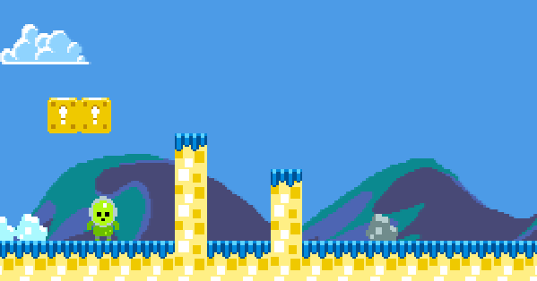
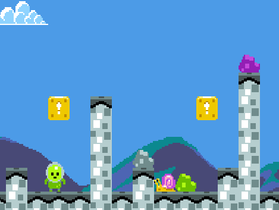
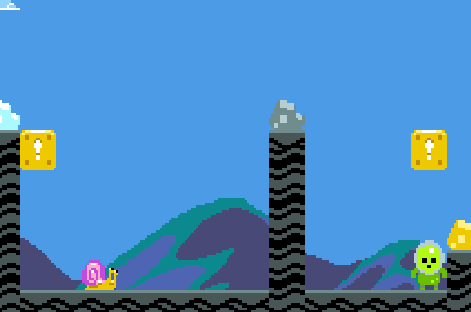
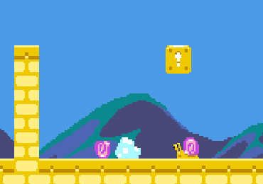
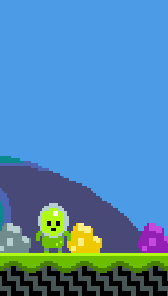
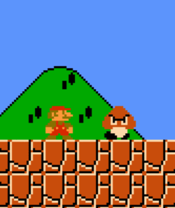

# Assignment 3 - Mario 🏃‍♂️

- 💯 **Worth**: 7%
- 📅 **Due**: October 9, 2023 @ 23:59
- 🚫 **Penalty**: Late submissions lose 10% per day to a maximum of 3 days. Nothing is accepted after 3 days and a grade of 0% will be given.

## 🎯 Objectives

- Read and understand all of the Mario [notes](https://jac-cs-game-programming-f23.github.io/Notes/#/3-Mario/) and [source code](https://github.com/JAC-CS-Game-Programming-F23/3-Mario) from Lecture 3.
- Ensure that when the player is dropped into the level, they're always done so above solid ground.
- Once all of the enemy snails have been killed, spawn a flagpole that the player can touch to proceed to the next level.
- Implement either a Mushroom, Flower, or Star power-up.
- Implement additional features for how the player character behaves in the world.

## 🎥 Demo

Sorry, I didn't have time to record a demo for this one! I did, however, provide GIFs below to illustrate the various features I'd like you to implement.

## 🔍 Context

Welcome to your fourth assignment! There was a lot to learn with cameras, tilemaps, entities, and game objects, but our game is still lacking in a few areas. By extending its functionality, we'll have something even closer to famous titles such as Super Mario Bros. or Sonic the Hedgehog!

1. 🗻 Right now, there's a chance that the a chasm is spawned at the beginning of the level which results in the player dropping immediately to their doom. To combat this, ensure that when the player is dropped into the level, they're always done so **above solid ground**.

   > 💡 Hint: `LevelMaker.js` is where the tilemap is procedurally generated, so, probably a good place to start!

2. 🚩 Once all of the enemy snails have been killed, **spawn a flagpole** at the end of the level.
   - When the player collides with the flagpole, the player should be dropped into a new level.
   - The sprites for the flagpole are in `assets/images/flagpoles.png`.
   - The location of the flagpole is up to you, just make sure that it appears on solid ground and not mid-air.
   - No, you don't have to make the flag waving animation, but it shouldn't be hard to do!

   > 💡 Hint: I would probably start by creating a `Flagpole` class that extends `GameObject`. Deduce what properties it should have by examining the other game objects in the `src/objects/` folder.

3. **Choose one** of the following power-ups to implement:
   1. 🍄 Mushroom power-up that will increase your size and enable the player to absorb one hit from an enemy without dying.

        

      - Upon being hit by an enemy in the big form, the player should go back to the small form. Once back to the small form, if the player gets hit again, then the player should die.
      - The sprites for the bigger character can be found in `assets/images/character-big.png`.
   2. 🌼 Flower power-up that will enable the player to send out a fireball in front of them depending on which direction they are facing.

        

      - When the player collides with the flower object, they should turn into the pink alien. The sprites for the fire-power character can be found in `assets/images/character-pink.png`.
      - The sprites for the fireballs can be found in `assets/images/fireballs.png`.
      - If the fireball collides with an enemy, the fireball should despawn and the enemy should die.
      - If the player collides with an enemy, they should lose their fire abilities and turn back to the regular green alien.
      - The number of fireballs that can be on the screen at any given time is up to you.
      - The key the player should press to send out the fireball is up to you.
   3. ⭐ Star power-up that will make the player invincible for a short period of time.

        

      - When the player collides with the star object, they should turn into the blue alien. The sprites for the invincible character can be found in `assets/images/character-blue.png`.
      - If the player collides with any enemy in any player state, the enemy should die.
      - After a period of time has passed, decided by you, the player should turn back into the regular green alien.

   > 💡 Hint: No matter which power-up you decide to implement, you will probably have to modify the `Player` class and create new game objects in the `src/objects` folder. For reference, look at `Coin::onConsume()` and use that as inspiration for how you can implement your power-up object similarly.
   >
   > Also, the three power-up sprites can be found in `assets/images/power-ups.png`.

4. **Choose two** of the following features to implement:
   1. ⛹️‍♂️ Jump a tiny amount when falling on an enemy.
      - Right now, the player "falls through" the enemy upon collision. In most games like Mario, the player character will "jump off" the enemy when the enemy is jumped on.

        

      > 💡 Hint: Can we transition to the player's jump state on collision with an enemy?

   2. 📏 Jump a variable amount based on how long the spacebar is pressed.
      - Right now, the player jumps the same height every time the spacebar is pressed. In most games like Mario, the height of the jump is influenced by the amount of time the player held the jump button down for.

        

      > 💡 Hint: You can capture the number of frames that have passed since the player pressed a certain button. For a better idea, [see this CodePen](https://codepen.io/vsingh7/pen/KKqOBar).

   3. 🏃‍♀️ Hold `Shift` (or another button) to run which will increase the player's top speed and make them jump higher.
      - If you do choose `Shift` as your run key, you'll have to then listen for keypresses for capital `A` and `D` since right now we're only listening for lowercase `a` and `d`.
   4. 💀 Play an animation when an enemy kills the player upon collision.
      - Once the animation finishes, you can decide if the player reappears on the same level or if a completely new level is generated.
      - If we use Mario as an example, here's what he looks like when he runs into an enemy:

        

      - Your animation doesn't have to look exactly like this, but feel free to use it as inspiration!

      > 💡 Hint: Creating a `PlayerDyingState` is probably a good place to start! Use `SnailDyingState` as reference.

## 🌿 Git

You can use either the Git CLI or you can also use VSC's built-in Git GUI client.

### 🖱️ GUI

1. In VSC, click on the third icon down in the left navigation bar to see a list of files that have changed and are ready to be staged.
2. Hover over where it says _Changes_ (right below the commit textbox) and click `+` to stage all the modified files to be committed. Alternatively, you can add specific files by clicking the `+` next to the individual file.
3. Type a commit message into the textbox and click the checkmark above it to commit all the files that were just staged.
4. Click `...` and then `push` to push the commit(s) up to GitHub.

### ⌨️ CLI

1. Run `git status` to see a list of files that have changed and are ready to be staged.
2. Run `git add .` to stage all the modified files to be committed. Alternatively, you can add specific files like this: `git add src/Coin.js`.
3. Run `git commit -m "A descriptive message here."` (including the quotes) to commit all the files that were just staged.
4. Run `git push` to push the commit(s) up to GitHub.

Regardless of the method you choose, it is very important that you commit frequently because:

- If you end up breaking your code, it is easy to revert back to a previous commit and start over.
- It provides a useful log of your work so that you (and your teammates if/when you're on a team) can keep track of the work that was done.

## 📥 Submission

> 💡 Note that the grading criteria can be found on Gradescope, but only after you've submitted. You're able to submit infinitely, so it might be a good idea to submit a blank repo first in order to reference the grading criteria while working on this assignment.

Once you've made your final `git push` to GitHub, here's what you have to do to submit:

1. Go to [Gradescope](https://www.gradescope.ca/courses/11530) and click the link for this assignment.
2. Select the correct repository and branch from the dropdown menus.
3. Click _Upload_.
4. Record a screencast, **not to exceed 5 minutes in length**, in which you demonstrate your game's functionality.
   - The video should be recorded and uploaded using Microsoft Stream. [Please watch this instructional video on how to do so](https://web.microsoftstream.com/video/62738103-211f-4ddd-bb4a-c594eddcfb0a?list=studio) (you'll have to log in with your JAC email and password).
     - In the instructional video I mention to toggle on the "share sound" option. I later realized that it might be hard to hear what you'll be saying if the game music is playing, so feel free to toggle off the "share sound" option if you find that it's hard to hear yourself over the music in the recording.
     - While recording, make sure to zoom in on the web page to have the game take up most of the screen. You can zoom by hitting `CMD + +` (Mac) or `CTRL + +` (Windows).
   - In your video's description, please timestamp where each of the following occurs in your gameplay demonstration:
     - Player always being spawned above solid ground
     - Flagpole spawning after all enemies are killed
     - One of the Mushroom/Flower/Star power-ups outlined in point #3 in the `🔍 Context` section above
     - Two of the features outlined in point #4 in the `🔍 Context` section above
   - Add your video to the correct (**classic!!**) Stream channel for this assignment. Instructions for this are in the video link above.
